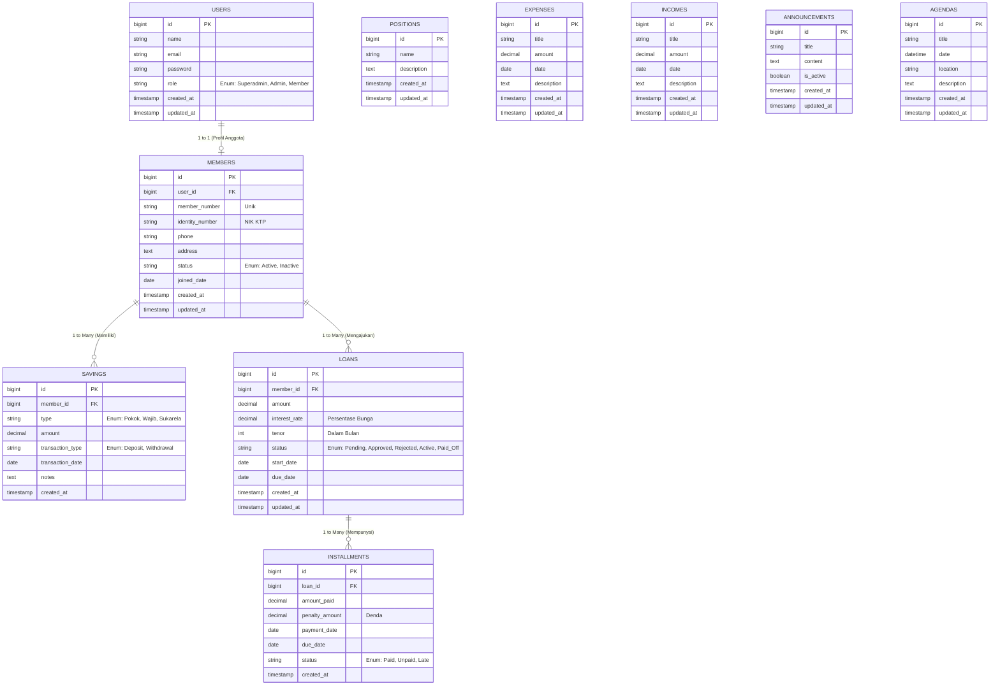

# Product Requirements Document (PRD) - Sistem Manajemen Koperasi

## 1. Pendahuluan
**Sistem Manajemen Koperasi** adalah platform berbasis web yang dirancang untuk mendigitalisasi dan mempermudah operasional koperasi, baik itu koperasi simpan pinjam maupun koperasi serba usaha. Sistem ini bertujuan untuk meningkatkan transparansi, akurasi, dan efisiensi dalam pengelolaan anggota, pencatatan simpanan, pengajuan pinjaman, dan pembayaran angsuran.

### 1.1 Visi & Misi
- **Visi:** Menjadi tulang punggung digitalisasi koperasi yang aman, cepat, dan transparan.
- **Misi:** Menyediakan antarmuka yang intuitif bagi admin dan anggota, serta memastikan integritas dan keamanan data transaksi finansial koperasi.

## 2. Target Pengguna
1. **Superadmin / Ketua Koperasi:** Memiliki akses penuh ke sistem, mengatur peran pengguna, dan melihat seluruh laporan keuangan.
2. **Admin / Bendahara:** Mengelola transaksi harian (simpanan, pinjaman, dan angsuran) serta melakukan verifikasi data anggota.
3. **Anggota (Member):** Pengguna akhir yang menggunakan sistem untuk melihat saldo simpanan, sisa pinjaman, riwayat transaksi, dan mengajukan pinjaman baru secara online.

## 3. Fitur Utama (Core Features)
- **Manajemen Keanggotaan:** Pendaftaran anggota baru, manajemen status (aktif/non-aktif), dan profil anggota.
- **Manajemen Simpanan:** Pencatatan Simpanan Pokok, Wajib, dan Sukarela.
- **Manajemen Pinjaman:** Pengajuan pinjaman, persetujuan/penolakan (approval workflow), dan simulasi angsuran.
- **Pembayaran Angsuran:** Pencatatan tagihan dan pembayaran bulanan (termasuk denda keterlambatan).
- **Laporan & Dasbor:** Ringkasan arus kas (cash flow), laba/rugi (SHU), dan performa koperasi secara real-time.

---

## 4. Skema Data & Arsitektur

### 4.1 Penjelasan Naratif (Arsitektur & Skema)
Sistem ini menggunakan arsitektur berbasis MVC (Model-View-Controller) yang diimplementasikan menggunakan framework **Laravel**. Database menggunakan relational database (SQLite untuk environment lokal/development, dan dapat ditingkatkan ke MySQL/PostgreSQL untuk produksi). 

**Entitas Utama dalam Skema Data:**
1. **Users:** Mengelola kredensial autentikasi, peran (role), dan otorisasi akses ke dalam sistem. Entitas ini mencakup Superadmin, Admin, dan juga kredensial login bagi Anggota.
2. **Members (Anggota):** Menyimpan profil detail dari anggota koperasi seperti Nomor Induk Anggota, NIK, alamat, pekerjaan, dan tanggal bergabung. Entitas ini memiliki relasi *one-to-one* dengan entitas `Users`.
3. **Savings (Simpanan):** Mencatat setiap transaksi setoran maupun penarikan yang dilakukan oleh anggota, diklasifikasikan berdasarkan jenis (pokok, wajib, sukarela).
4. **Loans (Pinjaman):** Mencatat permohonan pinjaman, status permohonan (pending, approved, rejected, paid_off), total pinjaman, bunga, dan tenor.
5. **Installments (Angsuran):** Mencatat riwayat pembayaran angsuran untuk suatu pinjaman, lengkap dengan jatuh tempo, jumlah denda (jika ada), dan tanggal pembayaran.
6. **Positions (Jabatan):** Menyimpan daftar jabatan atau posisi (contoh: Ketua, Bendahara, dll) yang ada dalam struktur organisasi koperasi.
7. **Expenses (Pengeluaran):** Mencatat pengeluaran operasional koperasi (seperti alat tulis, tagihan listrik, gaji karyawan).
8. **Incomes (Pemasukan):** Mencatat pemasukan koperasi di luar transaksi simpanan/angsuran (misal: sumbangan, bagi hasil unit usaha).
9. **Announcements (Pengumuman):** Menyimpan informasi atau pengumuman penting yang ditujukan untuk seluruh anggota koperasi.
10. **Agendas (Agenda):** Mencatat agenda atau jadwal kegiatan koperasi (seperti Rapat Anggota Tahunan, audit internal, dll).

### 4.2 Visualisasi ERD (Mermaid Diagram)

## 5. Non-Functional Requirements (NFR)
1. **Keamanan (Security):** Implementasi Role-Based Access Control (RBAC), enkripsi password (Bcrypt), proteksi terhadap CSRF dan SQL Injection.
2. **Kinerja (Performance):** Respon API harus kurang dari 500ms di bawah beban normal.
3. **Ketersediaan (Availability):** Desain sistem untuk uptime 99.9%.
4. **Responsivitas (UI/UX):** Antarmuka web (NiceAdmin Bootstrap) harus responsif terhadap perangkat desktop, tablet, maupun mobile.

## 6. Rencana Fase Pengembangan (Milestones)
- **Fase 1:** Setup Repository, Autentikasi & Otorisasi, Integrasi Tema NiceAdmin.
- **Fase 2:** CRUD Modul Keanggotaan & Transaksi Simpanan (Savings).
- **Fase 3:** Modul Pinjaman (Loans) & Angsuran, implementasi kalkulator bunga.
- **Fase 4:** Laporan Keuangan, Dasbor Analitik, Eksport PDF/Excel.
- **Fase 5:** UAT (User Acceptance Testing) & Deployment.
